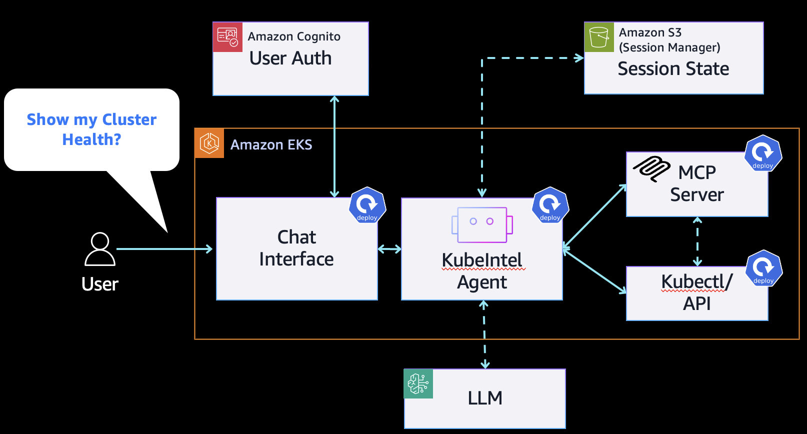

<div align="center">
  
</div>

# KubeIntel

**From DevOps to NoOps: Autonomous Kubernetes Management with AI Agents**

KubeIntel transforms complex Kubernetes operations into intelligent, autonomous insights using Claude AI. Move beyond traditional monitoring to AI-driven cluster management that understands, predicts, and recommends.

## 🏗️ Architecture

<div align="center">
  
</div>

**Autonomous AI Pipeline**: User queries → Chat Interface → KubeIntel Agent → AWS AI Services → Kubernetes API → Intelligent Actions

## ✨ From DevOps to NoOps

### Traditional DevOps Challenges
- **Manual Monitoring**: Constant dashboard watching and alert fatigue
- **Reactive Troubleshooting**: Issues discovered after impact
- **Complex Analysis**: Hours spent correlating logs, metrics, and events
- **Knowledge Silos**: Expertise locked in individual team members

### KubeIntel's NoOps Approach
- 🧠 **AI-Powered Analysis**: Claude 3.5 models provide expert-level cluster insights
- 🔮 **Predictive Intelligence**: Proactive issue detection before problems occur
- 💬 **Natural Language Interface**: Ask questions like "Why is my app slow?" 
- 🤖 **Autonomous Monitoring**: Continuous background analysis with intelligent alerts
- 📊 **Contextual Insights**: AI understands Kubernetes relationships and dependencies

## 🚀 Quick Start

### Prerequisites
- AWS account with Bedrock access
- EKS cluster or Kubernetes with AWS connectivity
- kubectl and Helm 3.x

### 1. Setup AWS Permissions
```bash
export AWS_ACCOUNT_ID=$(aws sts get-caller-identity --query Account --output text)
export AWS_REGION=us-east-1

./setup-irsa.sh
```

### 2. Deploy with Helm
```bash
helm install kubeintel ./helm \
  --namespace kubeintel \
  --create-namespace \
  --set aws.region=$AWS_REGION \
  --set aws.roleArn="arn:aws:iam::$AWS_ACCOUNT_ID:role/KubeIntelAgentRole" \
  --set image.repository="YOUR_ACCOUNT_ID.dkr.ecr.YOUR_REGION.amazonaws.com/kubeintel" \
  --set config.strands.model=us.anthropic.claude-3-5-haiku-20241022-v1:0
```

### 3. Access Your AI-Powered Dashboard
```bash
kubectl get svc kubeintel -n kubeintel
# Access via LoadBalancer endpoint
```

## 🎯 AI-Driven Capabilities

### Intelligent Analysis
- **Natural Language Queries**: "Show me pods with high memory usage"
- **Root Cause Analysis**: AI correlates symptoms to identify underlying issues
- **Performance Optimization**: Automated recommendations for resource tuning
- **Security Assessment**: AI-powered security posture evaluation

### Autonomous Monitoring
- **Continuous Intelligence**: 24/7 background monitoring with AI insights
- **Predictive Alerts**: Early warning system for potential issues
- **Trend Analysis**: AI identifies patterns humans might miss
- **Automated Remediation**: Intelligent suggestions for issue resolution

### Multi-Modal Dashboards
- **Main Dashboard**: Comprehensive cluster health with AI recommendations
- **Flow Visualizer**: Real-time request traces and performance analysis
- **Cost Visualizer**: AI-optimized token usage and cost projections

## ⚙️ Configuration

### AI Model Configuration
```bash
# Claude 3.5 Models (Recommended)
AGENT_STRANDS_MODEL=us.anthropic.claude-3-5-haiku-20241022-v1:0
AGENT_STRANDS_FALLBACK_MODEL=us.anthropic.claude-3-5-sonnet-20241022-v2:0

# AWS Configuration
AWS_REGION=us-east-1
AWS_ROLE_ARN=arn:aws:iam::YOUR_ACCOUNT:role/KubeIntelAgentRole

# Performance Tuning
AGENT_ANALYSIS_TIMEOUT=300
AGENT_SESSION_TTL=7200
```

## 🔒 Enterprise Security

- **Zero Trust Architecture**: IAM roles and RBAC-based access control
- **AI Safety**: Validated AI outputs with human oversight capabilities
- **Audit Trail**: Comprehensive logging of all AI decisions and actions
- **Data Privacy**: Cluster data processed securely within your AWS environment

## 📊 Performance & Cost Optimization

- **Intelligent Session Management**: AI-optimized context rotation for cost efficiency
- **Response Times**: Sub-60 second analysis for most queries
- **Cost Transparency**: Real-time token usage tracking and optimization
- **Scalable Architecture**: Handles enterprise-scale Kubernetes environments

## 📄 License

This project is licensed under the MIT License - see the [LICENSE](LICENSE) file for details.

---

<div align="center">
  <p><strong>Transform your Kubernetes operations from reactive DevOps to proactive NoOps</strong></p>
  <p>
    <a href="https://github.com/your-org/kubeintel/issues">Report Bug</a> •
    <a href="https://github.com/your-org/kubeintel/issues">Request Feature</a>
  </p>
</div>
